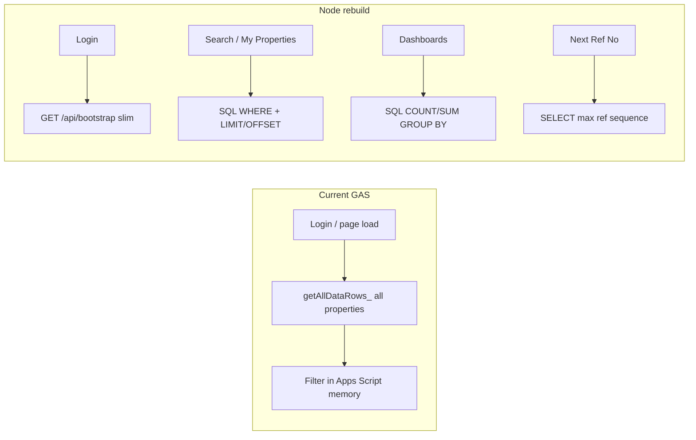
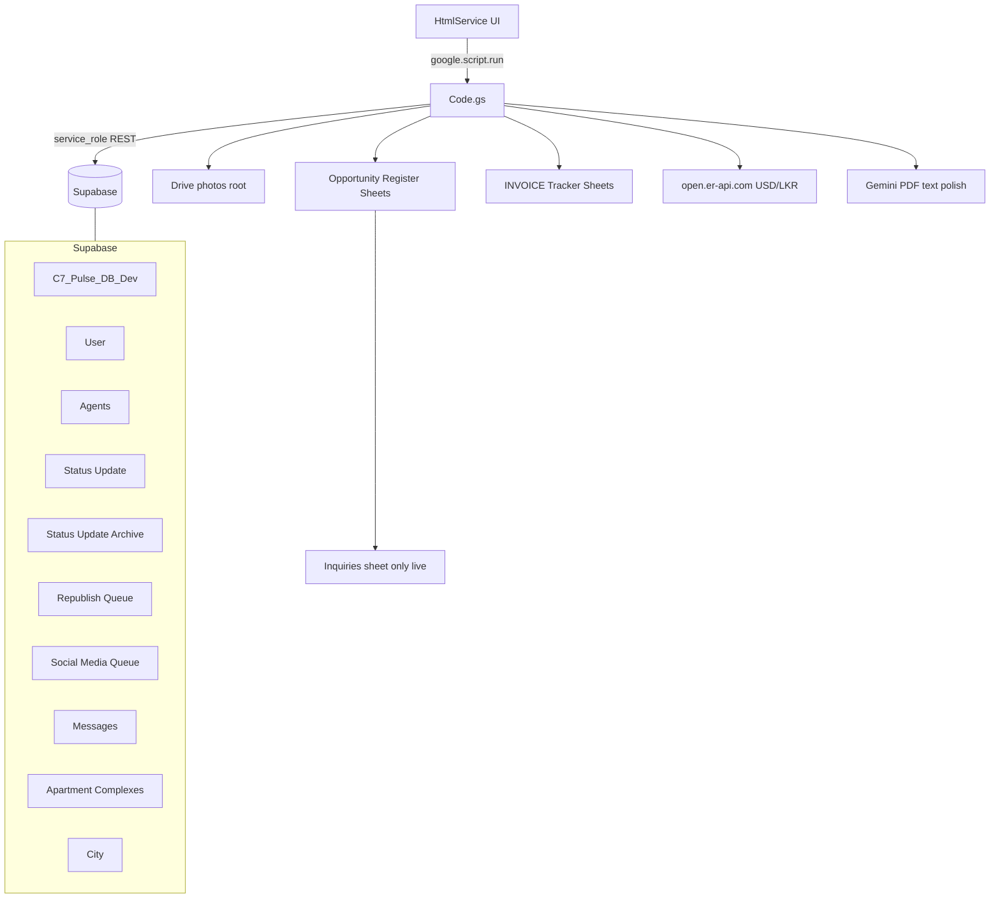

# Central7 Pulse — Full Rebuild Plan (Code.gs–informed)

## Constraints locked in

- **Behavior source of truth:** [`Script/Code.gs.txt`](Script/Code.gs.txt) (~3.2k lines) + current Supabase tables. Companion HTML files are still empty — UI layout inferred from API surface.
- **Storage:** Google Drive for photos (root folder `1RJ1xTzHptaNdAfiZ3z8v1_CN_FfR6Th0`); DB stores Drive file IDs / folder names only.
- **Auth:** Supabase Auth + `profiles` (replace GAS CacheService session tokens + salted SHA-256 in `User.Password`).
- **Target:** Supabase free tier (~500MB DB) — typed columns, normalization, SQL filters.
- **Performance mandate:** **Never** load the entire properties table into the app on login or any normal screen (fixes current GAS `getAllDataRows_` bottleneck).

---

## Performance problem in current system (must fix)

Code.gs comment and code confirm this explicitly:

- On page load, several `google.script.run` calls each triggered a **full download** of `C7_Pulse_DB_Dev` via `getAllDataRows_()` (paged REST, but still **all rows**).
- That caused Supabase **statement timeout 57014**; they patched with a script lock + retries — still pulls ~10k+ rows into memory.
- Callers that still depend on full table today:
  - `searchProperties` → `getAllDataRows_()` then filter in JS (cap 500 unless `noLimit`)
  - `getMyProperties` → `searchProperties({…, noLimit: true})` → **entire table**
  - `generateNextRefNo` / `checkRefNoAvailable` / `searchRefNos` → full scan
  - `getAllListingRows_` / listings dashboard → full scan
  - bulk import uniqueness checks → full scan

**Rebuild rule:** every list/search/dashboard/ref-next operation is a **targeted SQL query**. The browser never receives the full inventory.

### Login / first paint — slim bootstrap only

`GET /api/bootstrap` (authenticated) returns **only**:

- current profile (name, role, photo)
- form options: enums, cities list, apartment complexes, staff names for filters
- small badges: unread message count, pending republish count, pending agent count (admins), SM queue count (if allowed)
- FX rate (cached)

**Does not** return properties, activity log, or queues.

### Screen-by-screen data loading

| Screen | API shape | Default page size |
|--------|-----------|-------------------|
| Property search | `GET /properties?filters…&cursor=` or `page&limit` | 25–50 |
| My Properties | same, filtered `created_by = me` (Admin may pass target) | 25–50 |
| Property detail | `GET /properties/:refNo` + photos on demand | 1 |
| Activity Log | filtered by assignee + date + action; paginated | 50 |
| Republish / SM queues | incomplete rows only; paginated | 50 |
| Messages | unresolved for me; paginated | 50 |
| Dashboards | aggregate SQL / RPC — **counts only**, not row dumps | n/a |
| Ref autocomplete | `ref_no ILIKE` with index, limit 8–20 | 8 |
| Next Ref No | `SELECT` max numeric suffix / sequence — O(1) | 1 |

### Schema support for fast queries

- Indexes on: `ref_no`, `status`, `property_type`, `city_id`, `created_by`, `created_at DESC`, `(opportunity_type, status)`, price columns used in filters.
- Optional `ref_seq int` generated/stored from `C7-{n}` for O(1) next-ref (unique).
- Materialized or SQL views for dashboard KPIs if needed later; start with indexed `COUNT(*) FILTER` queries.
- List endpoints return a **card DTO** (ref, type, city, status, price, contact redacted flag) — not the full 48-field row — until detail open.

### Explicit anti-patterns (ban in code review)

- No `select * from properties` without `LIMIT` in app code.
- No “download all then filter in Node/React”.
- No login prefetch of My Properties full history without pagination.
- Bulk admin export (if needed) is a **separate** job/stream endpoint, never the default UI path.

### Perf acceptance criteria

- Login → bootstrap response payload small (target well under ~100KB typical).
- Search / My Properties first page returns in interactive time on free-tier Supabase with 10k+ rows.
- Hot paths verified with `EXPLAIN (ANALYZE)` during Phase 5.
- Automated check or lint comment: no repository method named like `getAllProperties()`.

---

## Current architecture (from Code.gs)

**Still on Sheets today:** Inquiries CRM + entire Invoice/Commission dashboard (year tabs 2020–2026). Legacy Form Responses / Users / Status sheets are leftover helpers.

**Security model today:** privileged APIs take `sessionToken` → `resolveSession_` / `requireAdmin_`; Agents are blocked from staff write APIs; many **read** APIs are unauthenticated (guest/agent search, photos, PDF).

---

## Locked domain enums (from Code.gs)

| Domain | Values |
|--------|--------|
| Opportunity | `Sell`, `Rent Out` |
| Property type | `House`, `Land`, `Apartment`, `Commercial Property`, `Estate` (Estate uses House columns) |
| Listing status | `Active`, `Hold`, `Lost`, `Drop`, `Closed`, `Duplicate`, `Obsolete` |
| Activity actions | `Publish`, `Republish`, `Drop`, `Lost`, `Hold`, `New Ad Published`, `Closed`, `Data Change`, `Obsolete`, `Duplicate`, `Admin Edit`, boosts |
| Furnished | `Not Furnished`, `Partly Furnished`, `Fully Furnished` |
| Contact type | `Direct`, `Partner` |
| Platforms | `Ikman`, `LPW`, `Facebook`, `Instagram` |
| Boost platforms | `Ikman`, `Facebook` |
| Staff roles | `Admin`, `User` (+ session role `Agent` for partners) |
| Agent status | `Pending`, `Approved`, `Rejected` + Active flag |
| Ref prefix | `C7-` sequential |
| Currency | `LKR` default, `USD` (+ USD/LKR rate cache) |
| Amenities | fixed 21-item list in Code.gs |

**Named routing (preserve as configurable assignments, not hardcoded forever):**

- New Publish / Republish / Data Change / Ikman boost → **Assigned To: Keerthie**
- Facebook boost → **Assigned To: Sherden**
- Social Media Queue access: Admins + **Gokulesh**
- Admin overview exception: **Theeban**
- Republish Queue clear super-user: **Sherden**

---

## Property model (48 columns → typed schema)

Code.gs writes **type-specific column groups**; Supabase duplicates headers as `_1` / `_2`.

| Type | Fields used |
|------|-------------|
| House / Estate | purpose, land size, beds, baths, floor area, floors, parking, age, amenities, other info |
| Land | land size, suitable for, amenities, other info |
| Apartment | complex, floor, rooms, baths, floor area, parking, view, amenities, comments |
| Commercial | purpose, land size, built-up, comments |
| Shared | contact*, opp type, prop type, address, city, currency, prices, budget, comments, furnished, status |

**Corrections vs earlier schema guess:**

- **Do Not Publish** is a **form flag only** (not stored today) — still skips Activity Log / SM workflow. New schema **will add** `do_not_publish boolean` so the rule is durable.
- **Agent Ref No** and **Internal Comments** appear in the DB dump you pasted but are **unused in Code.gs** — omit unless client confirms; do not block migration on them.
- **Property Sub-type** column exists but is never written — drop or keep nullable unused.
- External **Agents** table is **search-only partners**, not listing owners. Listing `User` is the staff name.

### Target tables

- `profiles` ← `User` (auth.users FK; role Admin/User; mobile; `photo_drive_id`; active)
- `agents` ← `Agents` (company, approval, `auth_user_id`; no passwords in table)
- `cities`, `apartment_complexes`
- `properties` — typed core + `amenities text[]` + `type_attributes jsonb` for type-only extras (`suitable_for`, `view`, `built_up_area`, etc.)
- `property_status_events` — merges Status Update + Archive (`archived_at`); columns: action/status, comment, requested_platforms[], assigned_to, boost fields (`lpw`, `boost_completed`, …)
- `republish_queue`, `social_media_queue` (platform date columns or `platform_dates jsonb`)
- `messages`
- `inquiries` — migrate off Sheets
- `property_media` — Drive file ids under folder named `ref_no` (optional index; can also list Drive live)
- `app_settings` — assignment targets, USD/LKR cache, invoice targets (replace hardcoded constants)
- `invoices` / `invoice_lines` — **Phase 5B** if porting Invoice Tracker into DB (else keep Sheets read adapter short-term)

### Indexes (free-tier)

- `properties(ref_no)`, `(status)`, `(city_id)`, `(property_type)`, `(created_by)`, `(created_at desc)`
- Status events `(assigned_to, archived_at)`, `(ref_no, created_at)`
- Queue unique on `property_id` / `ref_no`

### Security (harder than GAS)

- RLS on all tables; browser uses anon key + user JWT only.
- **Close the guest hole:** public search / photos / PDF go through API with rate limits + **contact redaction** for Agent/guest (server-enforced, not client-only).
- Service role only on Node server (migrations, admin jobs).
- Roles: `admin`, `user`, `agent`; SM queue grant via `app_settings` allow-list (Gokulesh today).

---

## Business rules the Node app must preserve

1. Session/JWT identity only — never trust client-supplied user/role.
2. Agents cannot call staff write APIs; search-only; contacts redacted server-side.
3. Ref Nos `C7-{n}` unique; generate under lock/transaction.
4. Required on create: contact name, contact1, opportunity type, property type, city.
5. Publish requires ≥1 platform unless `do_not_publish`; then no activity log row.
6. Status mapping: Data Change does **not** change listing status; Publish / Republish / New Ad Published → `Active`; else status = action.
7. Removals Drop/Lost/Hold/Closed auto-push Social Media Queue with prior platforms.
8. SM entry complete only when all requested platforms have dates.
9. Republish Queue actions are advertisement tracking — **do not** mutate property Status.
10. Owner-or-Admin for status changes; assignment filtering on Activity Log for Admins.
11. Messages: Users → Admins only; Admin can To=`All`; resolve+reply semantics.
12. USD/LKR normalization for price filters (cache ~12h, fallback rate).
13. Contact number normalization (`0…` / `00…` rules from Code.gs).

---

## Phase 0 — Access

1. Read access to old project `https://rbqgtzqdvzjnrzwehvcs.supabase.co` (or full table dumps).
2. Share Drive photos root (+ subfolders) with Google **service account**.
3. Export Inquiries sheet; decide Invoice Tracker: **keep Sheets adapter** (faster) vs **import to Postgres** (cleaner long-term). Default in this plan: Sheets adapter first, DB port later.
4. New Supabase project for rebuild (never mutate prod schema in place).

---

## Phase 1 — Schema + mapping

Artifacts:

- `supabase/migrations/0001_init.sql` — enums, tables, indexes
- `supabase/migrations/0002_rls.sql`
- `docs/schema-mapping.md` — every `PROPERTY_COLUMN_NAMES` entry → new column/JSONB path; Status Update fields; queues
- Seed `app_settings` with current assignment names / SM allow-list / amenities list

---

## Phase 2 — Extract + profile

Export: all 10 Supabase tables → `data/raw/`. Profile against Code.gs enums (unknown statuses → `legacy_*` map). Note password format (`salt:hash` vs plaintext). Count Drive folders under photos root vs property refs.

Also export Inquiries sheet; optionally sample invoice years for dashboard parity testing.

---

## Phase 3 — Clean + transform (local)

Pipeline `scripts/migrate/`:

1. Normalize keys / coerce numbers, dates, enums, contacts.
2. Split by `property_type` into core columns + `type_attributes`.
3. Merge duplicate comment fields (match `adminUpdatePropertyFields` consolidation behavior).
4. Resolve cities / complexes / staff profiles.
5. Auth: create users via invite / forced reset (do **not** try to import SHA-256 salt hashes into GoTrue).
6. Status events + queues linked by `ref_no`; reject orphans to `data/rejected/`.
7. Optional: walk Drive `C7-*` folders → `property_media` rows.

---

## Phase 4 — Load + validate

Load order: lookups → auth/profiles → agents → properties → status events → queues → messages → inquiries → media index.

Validate: row counts, ref continuity (`C7-` max), spot-check House/Land/Apt/Commercial samples, assignment fields present, DB size ≪ 500MB.

---

## Phase 5 — Node.js application (feature parity with Code.gs)

### Stack

- Node.js + TypeScript + **Fastify**
- `@supabase/supabase-js`, `googleapis` (Drive), optional Gemini
- `apps/api`, `apps/web` (React + Vite), `packages/shared` (zod enums matching Code.gs), `scripts/migrate`, `supabase/`

### API modules ↔ Code.gs

| Module | Port these behaviors |
|--------|----------------------|
| Auth + bootstrap | Staff/agent login; admin user mgmt; **slim** `/bootstrap` (no properties dump) |
| Properties | save; **SQL-filtered paginated** search & my-properties; detail by ref; admin patch; bulk import (xlsx in Node) |
| Refs | `max(ref_seq)` / indexed autocomplete — never full scan |
| Activity / boosts | status transitions, assignment routing, **paginated** log, archive >90d |
| Republish queue | list incomplete only, Excel replace, clear (Sherden), submit action |
| Social media queue | approve, platform done, complete, clear; Gokulesh access |
| Agents | signup honeypot, approve/reject/active, reset password |
| Messages | inbox counts + paginated threads |
| Drive | photos by ref folder on demand |
| Dashboards | **aggregate SQL** (my stats, admin overview, listings KPIs) — not `getAllListingRows_` |
| Invoice | Sheets adapter or DB (Phase 5B) |
| Inquiries | DB CRUD (replace Sheets) |
| PDF | Node PDF (+ optional Gemini polish) |
| FX | USD/LKR cache in `app_settings` |

### UI roles + loading UX

- Staff User / Admin (full CRM)
- Admin Activity Log (assignment-scoped)
- Social Media operator (Admin + allow-list)
- External Agent / Guest search (redacted)
- **UI must not** cache the full property corpus; use page/infinite-scroll; open detail fetches one record

### Hosting

Render or Railway; env for Supabase + Drive service account + `PHOTOS_ROOT_FOLDER_ID` + optional Gemini.

---

## Phase 6 — Cutover

1. Freeze GAS writes.
2. Final delta export → clean → upsert.
3. Deploy; keep old Supabase read-only 2–4 weeks.
4. Password reset / invite for all staff and agents.

---

## Delivery order

1. Schema + RLS + mapping doc + search indexes / `ref_seq`  
2. Extract / clean / load migration  
3. API (slim bootstrap, paginated properties, workflows, Drive)  
4. Web UI (no full-corpus client cache)  
5. Perf acceptance checks  
6. Invoice polish + cutover  

---

## Risks (updated)

| Risk | Mitigation |
|------|------------|
| Empty HTML — unknown exact UI | Build from API modules + client walkthrough; mirror Code.gs function groups |
| Hardcoded people (Keerthie/Sherden/Gokulesh) | `app_settings` assignments, not code constants |
| Password hashes incompatible with Supabase Auth | Invite / reset; never store passwords in `profiles` |
| Full-table fetch on login (GAS `getAllDataRows_`) | Slim bootstrap + paginated SQL everywhere; perf acceptance todo; ban full-table helpers |
| Invoice still on Sheets | Adapter first; migrate tables when stable |
| Public read APIs | Rate limit + redaction; optional auth gate if client agrees |

---

## Immediate next slice (on approve)

1. `supabase/migrations` DDL + RLS reflecting this Code.gs model.  
2. `docs/schema-mapping.md` for all 48 property columns + status/queue fields.  
3. Scaffold `scripts/migrate` + `data/raw|clean|rejected`.  
4. You provide old DB dump/credentials → profile → refine any enum outliers from live data.
